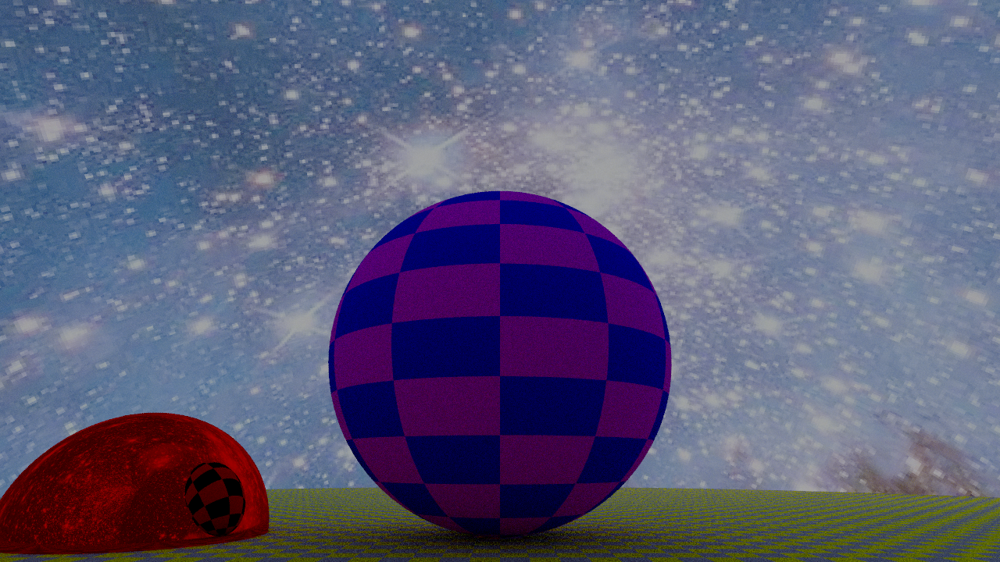
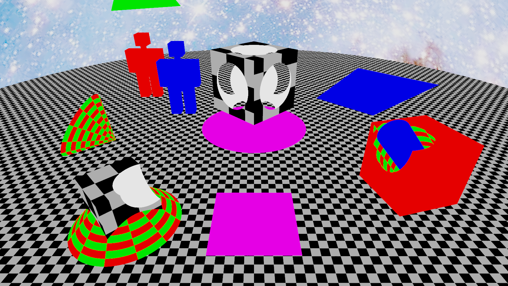
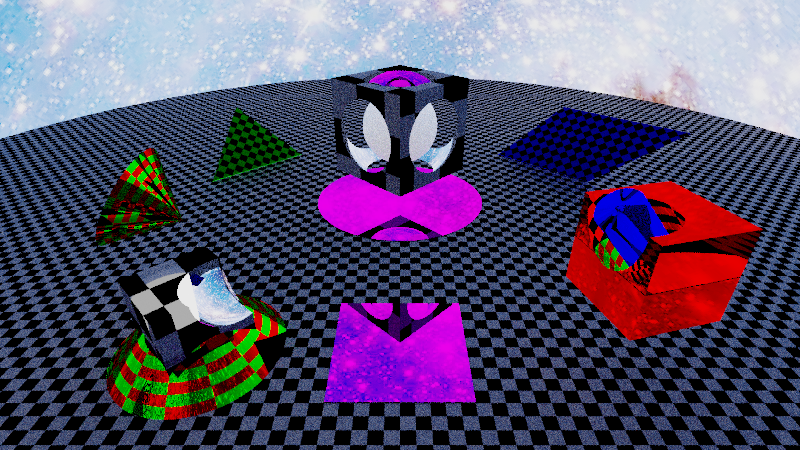
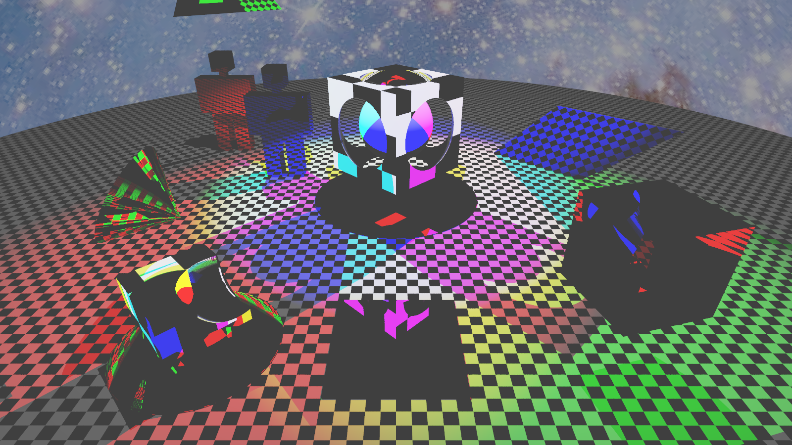
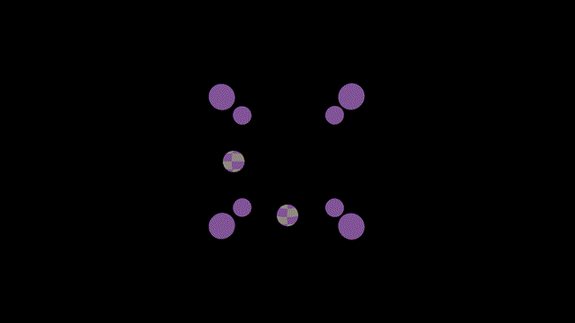

<div align="center">

# jujutracer

[](./LICENCE.md)
[](https://stevelonny.github.io/jujutracer/stable/)
[](https://stevelonny.github.io/jujutracer/dev/)
[](https://github.com/stevelonny/jujutracer/actions/workflows/TestOnMain.yml)

<!--  -->


Simple raytracer built in julia by Boldini M., Galafassi G. and Lonardoni S. during _Calcolo Numerico per la Generazione di Immagini Fotorealistiche_ (AY 2024/25) @ UNIMI.

</div>

## Installation

Clone this repository.

```bash
git clone https://github.com/stevelonny/jujutracer.git
```

## Usage

### Conversion PFM -> LDR formats
The user must provide the input file in the correct PFM format, the _a_ value and _gamma_ correction value, and the output file, which must be of the `.png` or `.jpg` extension.
```bash
julia main.jl <pfm_file> <a> <gamma> <output_file>
```

### Demo version
A demo scene is provided with the `demo.jl` script. The scene is composed by 8 spheres with a uniform pigment positioned on the edges of a cube, and 2 checkered spheres placed in the middle of two adiacent faces.
The user must provide the output filename, which will be used to saved the output image in both `.pfm` and `.png` formats, the width and height of the image and the camera angle.
```bash
julia demo.jl <output_file> <width> <height> <cam_angle>
```

#### CSG Showacase
A demo scene is provided for showcasing Constructive Solid Geometry capabilities. `demoCSG.jl` provides a perspective view of a few operations between 3 identical spheres translated along the three axis: union between 3 spheres, union of 2 spheres from which is substracted a 3rd one, and finally the intersection of all 3 spheres. Rotations are applied to the CSG shapes.

Usage of the script is similar to `demo.jl`:
```bash
julia demoCSG.jl <output_file> <width> <height> <cam_angle>
```

### Demo Path
A demo scene is provided for showcasing the path-tracer algorithm implemented. The scene is composed by a checkered diffusive plane used as a floor, which cut in half a reflective red sphere. Hovering the floor there is a checkered diffusive sphere, and a bright sky is provided.

Usage of the script is the same:
```bash
julia demoPath.jl <output_file> <width> <height> <cam_angle>
```
<div align="center">



</div>

### Steve's playground
To showcase all the newly added shapes by [#18](https://github.com/stevelonny/jujutracer/pull/18) and [#23](https://github.com/stevelonny/jujutracer/pull/23) a demo script implmenting CSGs, AABBs, and flat shape is provided with [`demoAll.jl`](/demoAll.jl). Modify the script with the preferred method of rendering, resolution, antialiasing and path tracing parameters.

<div align="center" style="display: flex; justify-content: space-around; flex-wrap: wrap;">

<div style="text-align: center; margin: 10px;">

<br/>
<strong>Flat renderer</strong>
<br/>
<em>800x450, AA=4</em>
</div>

<div style="text-align: center; margin: 10px;">

<br/>
<strong>Path Tracer</strong>
<br/>
<em>800x450, AA=2, 3 rays, 5 depth, 3 russian</em>
</div>

</div>

<div align="center" style="display: flex; justify-content: space-around; flex-wrap: wrap;">

<div style="text-align: center; margin: 10px;">

<br/>
<strong>Point-Light Tracer</strong>
<br/>
<em>1280x720, AA=4, depth=1000</em>
</div>

</div>

### Multi-thread support
*See issue [#22](https://github.com/stevelonny/jujutracer/issues/22)*

The code leverages multi-threading in a clean way simply by parallelizing each ray fired using the `@threads` keyword.
<!-- The following results have been obtained on a Windows 10 machine powered by an i5-10300H using julia 1.11.4, running both demo scenes illustrated previously at a resolution of `1920x1080`.
```powershell
C:\Users\steve\projects\jujutracer> julia -t 1 bench.jl
  Activating project at `C:\Users\steve\projects\jujutracer`
Number of threads: 1
Benchmarking demo...
  23.791 s (849584834 allocations: 40.53 GiB)
Benchmarking demoCSG...
  35.361 s (1248189420 allocations: 59.90 GiB)
C:\Users\steve\projects\jujutracer> julia -t 8 bench.jl
  Activating project at `C:\Users\steve\projects\jujutracer`
Number of threads: 8
Benchmarking demo...
  9.524 s (849584869 allocations: 40.53 GiB)
Benchmarking demoCSG...
  15.422 s (1248189455 allocations: 59.90 GiB)
C:\Users\steve\projects\jujutracer> 
``` -->

To leverage multi-thread, launch `julia` with the correct flag `t` and the number of threads to be assigned (or the `auto` keyword).
```bash
julia -t auto demo.jl <output_file> <width> <height> <cam_angle>
julia -t auto demoCSG.jl <output_file> <width> <height> <cam_angle>
```

#### Animation
`demogif.jl` creates 360 png images of the [`demo.jl`](#demo-version) scene by rotating the camera around the z-axis. The images can then be used as frames to generate a GIF. This script leverages multi-threading by paralallelizing the frame generation with the `@threads` macro. It will save into the `demo` folder, and won't overwrite existing frames, so that the process can be interrupted and recovered at a later moment. With the parallalization the generated frames won't be in order.
To launch execute:
```bash
julia -t auto demogif.jl
```
<div align="center">



</div>


## Contributing

Pull requests are welcome. For major changes, please open an issue first
to discuss what you would like to change.

Please make sure to update tests as appropriate.

## License
This project is licensed under the [MIT "Expat" License](LICENCE.md)
