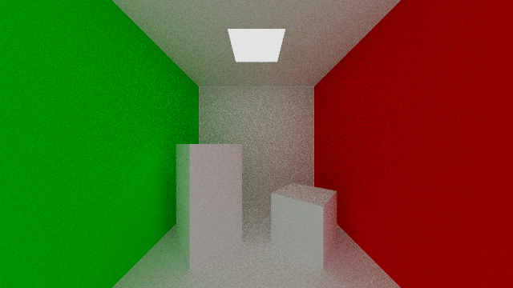

# Collection of scenes
This folder contains a collections of `.txt` files which define scene interpret by [`interpreter.jl`](../interpreter.jl). Some of them are just a translation of the demo scripts in the [`scripts`](/scripts) folder. Some of them are the translation of the ones provided in the [scripts](../scripts/) folder: `democsg.txt`, `demopath.txt` and `demoall.txt`.

## Cornell box

## Demo

## Tree

## Tree Box
Modified cornell box with a tree and reflective sphere.
