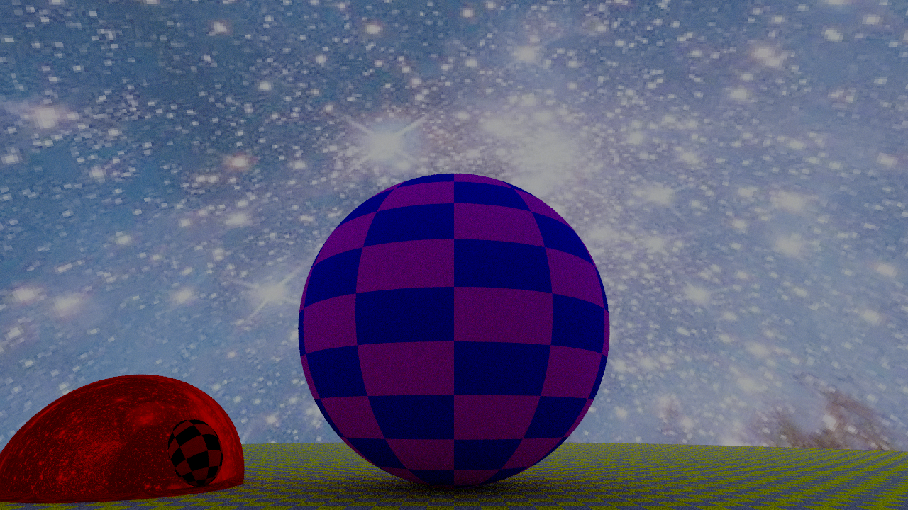
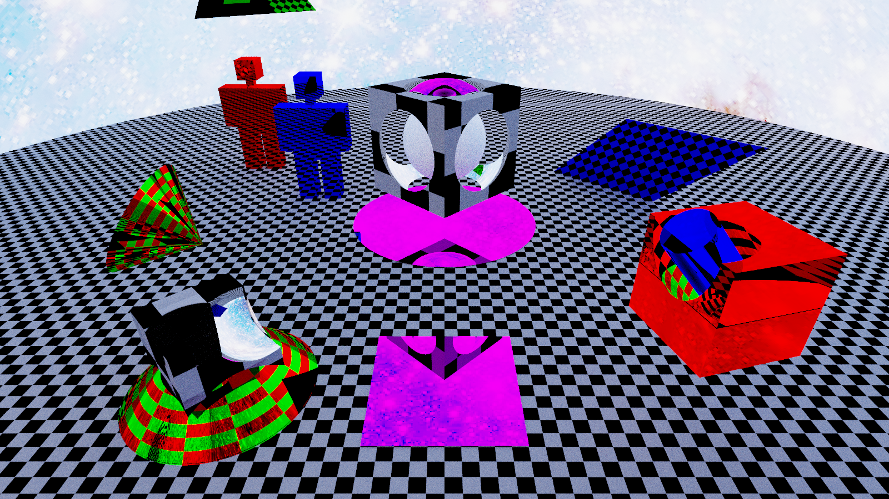
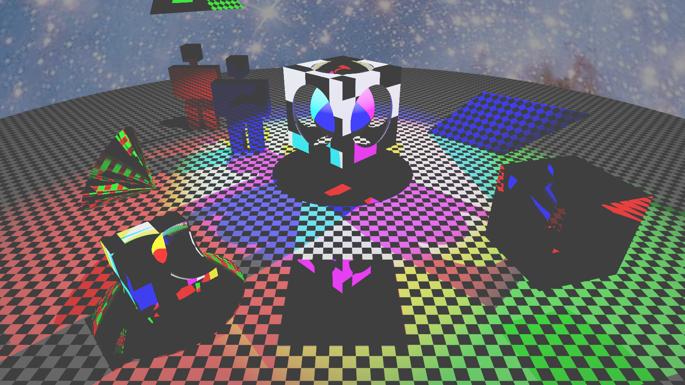

# Collection of scripts
This folder contains a collection of scripts to showcase the features of the `jujutracer` package.

## Demo version
A demo scene is provided with the `demo.jl` script. The scene is composed by 8 spheres with a uniform pigment positioned on the edges of a cube, and 2 checkered spheres placed in the middle of two adiacent faces.
The user must provide the output filename, which will be used to saved the output image in both `.pfm` and `.png` formats, the width and height of the image and the camera angle.
```bash
julia demo.jl <output_file> <width> <height> <cam_angle>
```

## CSG Showacase
A demo scene is provided for showcasing Constructive Solid Geometry capabilities. `demoCSG.jl` provides a perspective view of a few operations between 2 spheres and a cone: union between 3 shapes, union of 2 spheres from which is substracted the cone, and finally the intersection of all 3 shapes. Rotations are applied to the CSG shapes.

Usage of the script is similar to `demo.jl`:
```bash
julia demoCSG.jl <output_file> <width> <height> <cam_angle>
```

## Demo Path
A demo scene is provided for showcasing the path-tracer algorithm implemented. The scene is composed by a checkered diffusive plane used as a floor, which cut in half a reflective red sphere. Hovering the floor there is a checkered diffusive sphere, and a bright sky is provided.

Usage of the script is the same:
```bash
julia demoPath.jl <output_file> <width> <height> <cam_angle>
```
<div align="center">



</div>

## Steve's playground
To showcase all the newly added shapes by [#18](https://github.com/stevelonny/jujutracer/pull/18) and [#23](https://github.com/stevelonny/jujutracer/pull/23) a demo script implmenting CSGs, AABBs, and flat shape is provided with [`demoAll.jl`](/demoAll.jl). Modify the script with the preferred method of rendering, resolution, antialiasing and path tracing parameters.


|  |  |  |
|:-------------------------------:|:---------------------------------------------------:|:---------------------------------------------------:|
**Flat renderer**, 800x450, AA=4 | **Path Tracer**, 800x450, AA=2, 3 rays, 5 depth, 3 russian | **Point-Light Tracer**, 1280x720, AA=4, depth=1000

## Meshes support
A basic support for reading `.obj` files and the necessary framework necessary to render triangle meshes has been implemented. Such shapes are accelerated with boundary volume hierarchy leveraging a surface area cost algorithm.

`testBVH.jl` is a script which generate random triangles to bench the BVH tree construction.
<div align="center">


</div>

`demoPathWTree.jl` is a variation of [`demoPath.jl`](#demo-path), with a tree instead of the central sphere. The tree model is contained in [`tree.obj`](/asset/tree.obj), with his companions [`leaves.obj`](../asset/leaves.obj). The tree model is comprised of 133376 triangles, while the leafes are made of 113218 triangles. Here are some examples made with Point-Light tracer.

<div align="center">

|  |  |
|:-------------------------------:|:---------------------------------------------------:|
| **133376 total triangles**<br>_720x1280, AA=2, depth=5_ | **246594 total triangles**<br>_450x800, AA=2, depth=5_ |

</div>


## Animation
`demogif.jl` creates 360 png images of the [`demo.jl`](#demo-version) scene by rotating the camera around the z-axis. The images can then be used as frames to generate a GIF. This script leverages multi-threading by paralallelizing the frame generation with the `@threads` macro. It will save into the `demo` folder, and won't overwrite existing frames, so that the process can be interrupted and recovered at a later moment. With the parallalization the generated frames won't be in order.
To launch execute:
```bash
julia -t auto demogif.jl
```
<div align="center">


</div>
